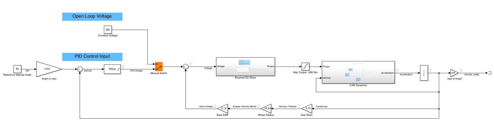

A cruise control loop for a car, modeled in Simulink — a DC motor driving the wheels, with a PID controller holding a set speed.

## The problem

Just applying a fixed voltage to the motor doesn't hold speed. As the car speeds up, the motor's back-EMF grows and eats into the available voltage, so the car settles wherever motor torque and back-EMF happen to balance — not at any speed you actually chose.

## Process

- A brushed DC motor turns voltage into torque, capped at 600 Nm.
- A PID controller compares actual speed to a 65 km/h reference and adjusts drive voltage to close the gap.
- A switch lets the model run open-loop (fixed voltage) or closed-loop (PID), so the two are easy to compare.

## Result
Comparing open and closed loop results
Open loop-  the car settles wherever torque and back-EMF happen to balance — not able to come to the reference speed 65 km/h. 
Closed loop, the PID controller corrects for that automatically and holds the reference speed.

*The full model — reference tracking, motor + drivetrain, and the open-loop/PID switch.*

**Download the model:** [CruiseControlCarModel.slx](./CruiseControlCarModel.slx)
