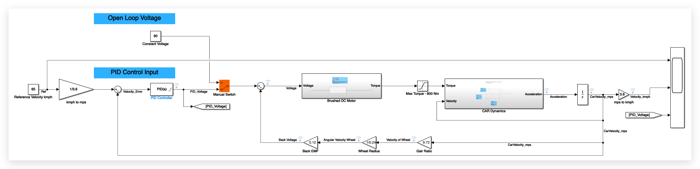
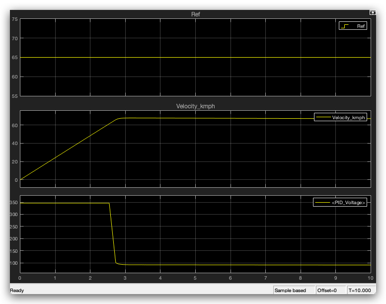
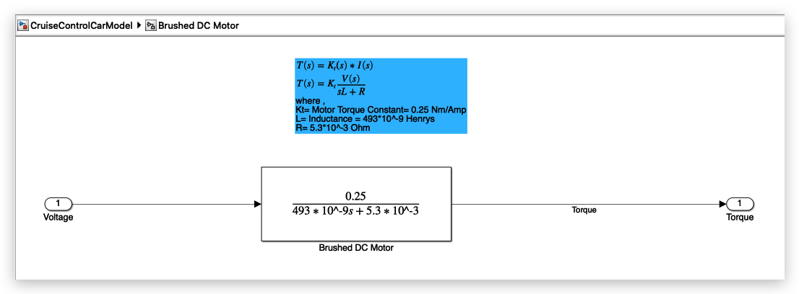
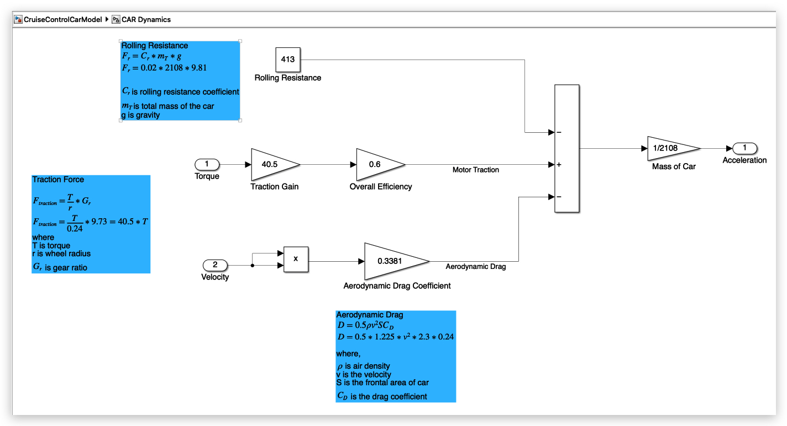

A cruise control loop for a car, modeled in Simulink. DC motor is driving the wheels and a PID controller is holding a set speed.

## The problem

If you apply a fixed voltage to the motor, it doesn't hold speed. As the car speeds up, the motor's back-EMF grows and eats into the available voltage, so the car settles wherever motor torque and back-EMF happen to balance — not at any speed you chose.

PID controller can be used to achieve any desired speed. 

## Process

- Setup a realistic dynamics model to mimic how a real vehicle will behave.
- Added DC motor mechanics, CAR dynamics for torque to acceleration conversion and back-emf working of the motor. 
- A brushed DC motor turns voltage into torque, capped at 600 Nm.
- A PID controller compares actual speed to a 65 km/h reference and adjusts drive voltage to close the gap.
- PID controller is tuned to work with these car parameters
- I've added a switch so we can compare open-loop (fixed voltage) and closed-loop (PID) performance.

## Result
Comparing open and closed loop results. 

Open loop-  the car settles wherever torque and back-EMF happen to balance out.

Closed loop- the PID controller corrects for that automatically and holds the reference speed.

## Simulink Modeling

*The full model — reference tracking, motor + drivetrain, and the open-loop/PID switch.*

**Download the model:** [CruiseControlCarModel.slx](./CruiseControlCarModel.slx)
