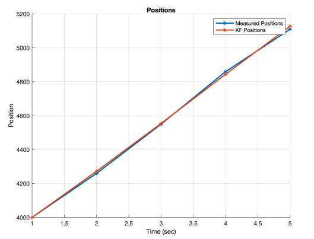
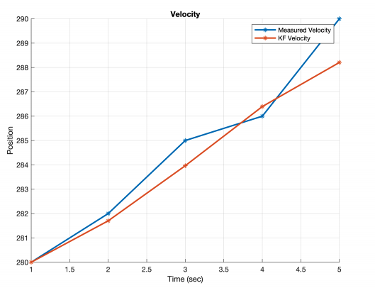

A Kalman filter that estimates an airplane's position and velocity along one axis from noisy measurements, in MATLAB.

## The problem

Raw measurements are noisy — position readings off by around 25 m, velocity readings off by around 6 m/s. Using them as-is gives a jumpy, less accurate track of where the airplane actually is.

## Process

- Model the airplane's motion with a simple constant-acceleration model (2 m/s²), updated once per second.
- Each step alternates between predicting the next position and velocity from that model (time update) and correcting the prediction against the next noisy measurement (measurement update) — weighted by the Kalman gain, which balances how much to trust the model versus the measurement.
- Run over 5 seconds of measurements, starting from an initial position of 4000 m and velocity of 280 m/s.

## Result

The filtered position and velocity track the underlying trend more closely than the raw measurements, especially velocity — the filtered estimate is visibly smoother than the noisy raw readings.

*Position: raw measurements vs. filtered estimate.*

*Velocity: raw measurements vs. filtered estimate — the filter smooths out most of the measurement noise.*

**Downloads:** [Live Script (.mlx)](./PositionVelocityKalmanFilter.mlx) · [Full write-up (.pdf)](./PositionVelocityKalmanFilter.pdf)
