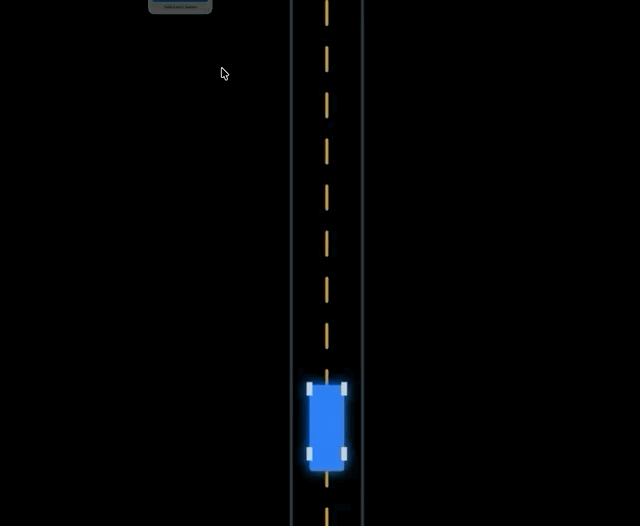

An interactive lane-centering simulation — a bicycle-model vehicle steered by an LQR-style controller, with the controller's gains derived from tunable cost weights instead of hand-picked.

## The problem

Lane centering means holding a car on the lane centerline through curves while correcting for disturbances, without wasting steering effort or letting the response get twitchy. Hand-tuning the feedback gains for that is trial and error — nudge a gain, drive it, see if it feels right, repeat. LQR (Linear Quadratic Regulator) control replaces that guesswork: you state what you care about as a cost function, and the gains that best balance those costs fall out of the math.

## Process

- Modeled the vehicle as a 4-state lateral error system relative to the road: lateral error, lateral error rate, heading error, and yaw rate — driven by a linear bicycle model with front/rear cornering stiffness, mass and yaw inertia as configurable parameters.
- Instead of exposing the four gains directly, exposed two cost weights — **Accuracy Cost (Q)**, penalizing lateral/heading error, and **Steering Cost (R)**, penalizing steering effort — and derived the gains from their ratio, the same relationship an LQR solve produces: higher Q/R means a stiffer, faster-responding controller; higher R trades accuracy for smoother steering.
- Added a geometric feedforward term (steer ≈ atan(wheelbase × road curvature)) so the controller isn't relying on feedback alone to track a curve — feedback only has to correct disturbances, not hold the turn.
- Scaled the gains by mass, yaw inertia and speed so the controller keeps the same closed-loop behavior as those parameters change, rather than needing to be re-tuned by hand every time.
- Ran the vehicle dynamics sub-stepped at 600 Hz (10× the render rate) for numerical stability, with the car and road rendered on a canvas in a tangent-locked view.
- Made the car draggable — grab it and drop it off-center or off-heading, and watch the controller bring it back — alongside live sliders for vehicle parameters and the Q/R cost weights.

To keep everything running smoothly at 600 Hz in the browser, the gains are computed with a fast, physically-motivated approximation rather than solving the algebraic Riccati equation numerically every frame: the Q/R ratio sets a target closed-loop bandwidth, which maps directly to the four gains and is then scaled to cancel out mass, inertia and speed effects. It reproduces the qualitative behavior of a full LQR solve — the tradeoffs move the way LQR theory predicts — without the cost of an iterative solver in the render loop.

## Result

The car holds the lane centerline through curves and recovers cleanly from manual disturbances, and moving the Q/R sliders visibly trades off tracking accuracy against steering aggressiveness exactly as LQR theory predicts — a hands-on way to build intuition for what those cost weights actually mean, instead of just reading them off a matrix.

*The car tracking the road centerline while the LQR Auto-Tuner recomputes gains live from the Q/R cost sliders.*

**Live simulation:** [Launch LQR Master Studio →](https://aquamarine-youtiao-730266.netlify.app/)
