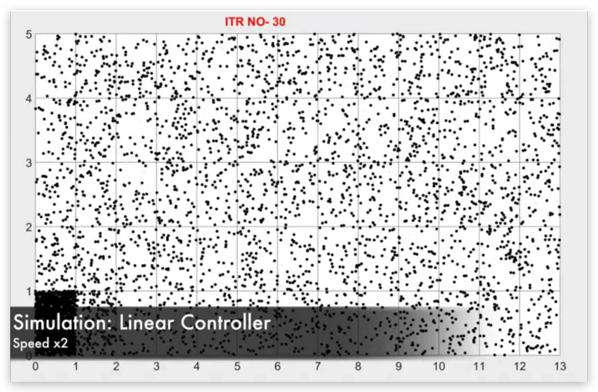
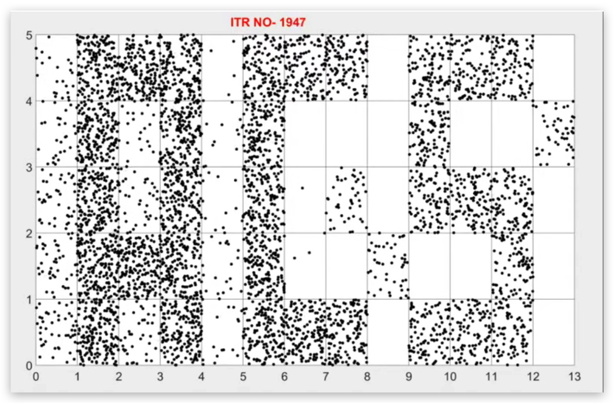
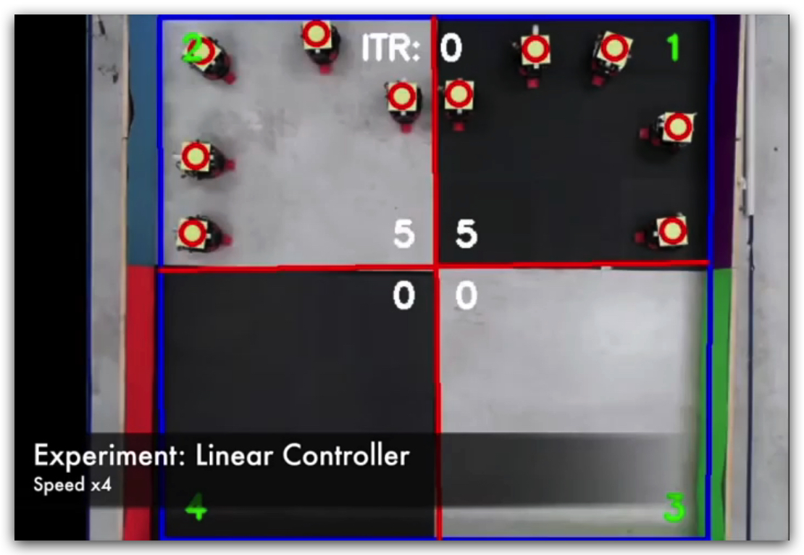
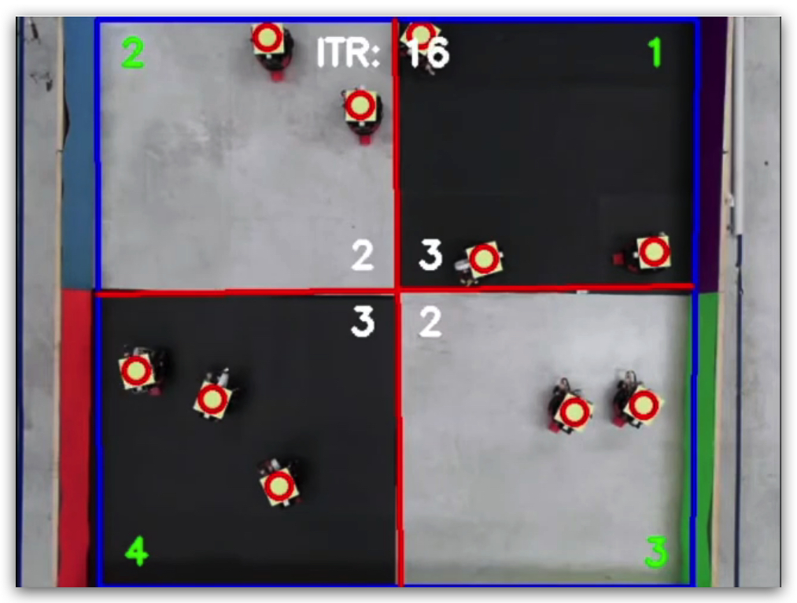

Designing a Linear Matrix Inequality (LMI) based controller to stabilize and steer Markov chain models — from an optimization formulation to a practical, sub-optimal version demonstrated on real ground robots.

## The problem

For a large population of simple robots, controlling every individual trajectory doesn't scale. A more tractable approach is to control the *distribution* of the swarm across a set of discretized regions instead — modeling each robot's motion between regions as a Markov chain, and designing the transition probabilities (the policy every robot follows) so the population-level distribution converges to, and stays at, a desired target distribution.

The challenge is that a transition matrix has to satisfy hard structural constraints — rows must be non-negative and sum to one — while also being stable and driving the chain toward the desired equilibrium. That makes naive optimization approaches awkward, but the problem can be cast as a Linear Matrix Inequality (LMI), for which efficient convex solvers exist.

## Process

- Modeled the swarm's population distribution over discretized regions as a discrete-time Markov chain, with the desired swarm distribution as the target equilibrium.
- Formulated stability and convergence-to-equilibrium conditions as LMIs, solving for a transition probability matrix that both stabilizes the chain at the target distribution and satisfies the Markov chain constraints (non-negative, row-stochastic).
- Validated the controller in simulation, then derived a practical, sub-optimal implementation that a resource-constrained, palm-sized ground robot could run — approximating the full LMI solution with something cheap enough to compute onboard.
- Deployed the resulting policy on real robots and compared the resulting population distribution against the simulated prediction.

## How the simulation works

At a high level, `particlesim.m` simulates a swarm of robots moving between regions, one time step at a time, and checks whether they settle into the target distribution.

- Each robot sits in one of a handful of regions. At every step, the sim looks at what fraction of the swarm is currently in each region and compares that to where we *want* the swarm to end up:

$$e = x - x_{eq}$$

- That error gets multiplied by the gain matrix $K$ (the output of the LMI solve) to get a control signal — basically, "how hard and in which direction to push the population right now":

$$u = K e$$

- The control signal is used to build a set of move probabilities: for each region, how likely is a robot there to hop to each other region in this time step. A few extra lines of code just clean these probabilities up so they're never negative and never add up to more than 1 (real probabilities have to behave).

- Then, instead of just tracking the fractions directly, the sim treats every robot as an individual particle: for each robot, it rolls a random number and uses the move probabilities to decide whether that robot stays or jumps to a new region.

- It repeats this for many time steps, recounts how many robots ended up in each region after every step, and that's the distribution plotted in the results below.

Simulating individual robots with randomness (rather than just the average fractions) is what makes this a fair stand-in for the real robot experiment — it has the same kind of noise a real swarm would have.

## Result

The mean-field controller drove the swarm's population distribution to the target equilibrium in both simulation and the physical robot experiment, validating that the sub-optimal onboard implementation preserved the convergence guarantees of the full LMI-based design.

## Matlab Simulation - Controller for 65 states

### Github Repo
[MarkovChainControl](https://github.com/vaibhavsd/MarkovChainControl.git)
### Source File
[particlesim.m](https://github.com/vaibhavsd/MarkovChainControl/blob/master/particlesim.m)

## Palm-sized robots - Controller for 4 states

### Github Repo
[pheeno_ros](https://github.com/vaibhavsd/pheeno_ros.git)
### Source Files
[src](https://github.com/vaibhavsd/pheeno_ros/tree/master/src)

# Video Demonstration

  

    <button type="button" class="yt-thumb" data-yt="sPKEEsyGtM0" aria-label="Play video: Mean Field Stabilization of Markov Chain Models in Simulation and Robot Experiment">
      
      
    </button>
    
Mean Field Stabilization of Markov Chain Models in Simulation and Robot Experiment

  

Full repo with the codebase is available at [MarkovChainControl](https://github.com/vaibhavsd/MarkovChainControl.git).

**Paper:** [Practical sub-optimal implementation of the control algorithm on palm-sized ground robots](https://ieeexplore.ieee.org/document/8264117) — IEEE Xplore, Jan 2018.
