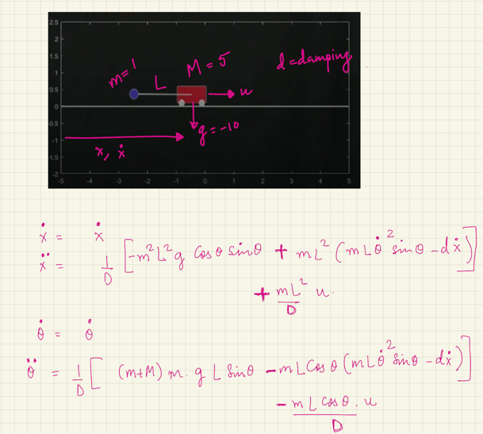
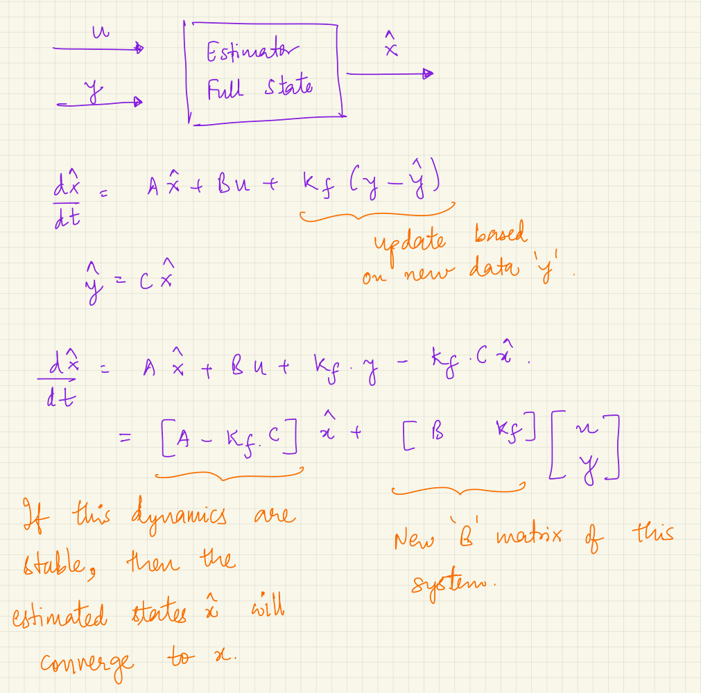

Modeling and controlling an inverted pendulum on a cart in MATLAB — building the linearized model, designing a stabilizing controller, then estimating the full state from a single noisy sensor.

## The problem

A pendulum balanced upright on a moving cart is open-loop unstable — nudge it and it falls. Balancing it needs a controller that reacts to the full state (cart position, cart velocity, pendulum angle, and how fast that angle is changing), but in practice you can only cheaply measure one of them.

## Process

- Linearize the cart-pendulum dynamics around the upright position into a 4-state model and confirm it's unstable (one pole at +2.4) but controllable.
- Design a stabilizing controller two ways: pole placement, which demanded unrealistically large actuator effort, and a Linear Quadratic Regulator (LQR), which found a far more practical tradeoff — and showed that controlling velocity and angular velocity mattered most.
- Check observability: measuring the cart's position alone is enough to reconstruct every other state, but measuring only its velocity is not.
- Design a Kalman filter (via LQE) that estimates all four states from that single noisy position measurement.
- Combine the two: the Kalman filter estimates the state, and the LQR controller acts on that estimate instead of needing a perfect measurement of everything.

## Result

The Kalman filter's estimated states track the true simulated states closely, even though it only ever sees one noisy position measurement — enough to close the loop with the LQR controller instead of needing four separate sensors.

*The system: a pendulum of mass m on a cart of mass M, driven by a horizontal force u.*

*The Kalman filter is its own dynamical system — it takes the control input and the noisy measurement and outputs an estimate of every state.*

## Full write-up

  <object data="./PendulumOnCart.pdf" type="application/pdf" class="pdf-embed" aria-label="Full write-up (PDF)">
    
Your browser can't display PDFs inline. <a href="./PendulumOnCart.pdf">Download the full write-up (PDF)</a> instead.

  </object>

**Downloads:** [Live Script (.mlx)](./PendulumOnCart.mlx) · [Full write-up (.pdf)](./PendulumOnCart.pdf)
