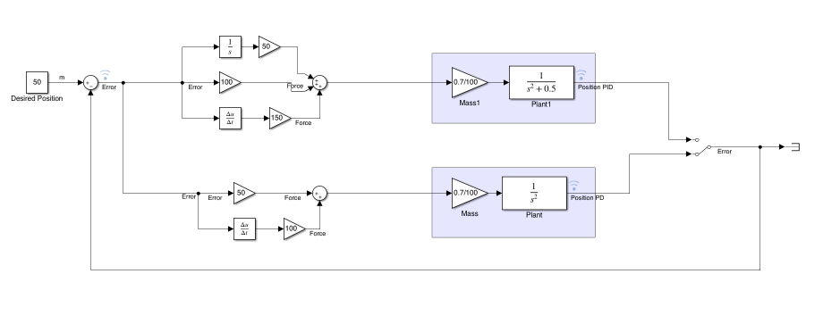

A Simulink model comparing PD and PID control for holding a train at a fixed position on a track.

## The problem

A PD controller alone doesn't guarantee the train settles exactly on target — depending on the plant, it can leave a small steady-state offset instead of reaching the reference position.

## Process

- Position error (desired minus actual) drives two separate controllers: PD and PID.
- Each controller pushes its own train/mass model, and a switch picks which one's output is compared to the target.
- The PID path adds an integral term on top of the same proportional and derivative gains.

## Result

Comparing PD and PID control side by side:
PD - the train gets close to the target position but can settle with a small steady-state offset.
PID - the added integral term removes that offset and holds the train exactly at the reference.

*The full model — PD and PID control paths driving the same train mass, switched for comparison.*

**Download the model:** [TrainModel.slx](./TrainModel.slx)
