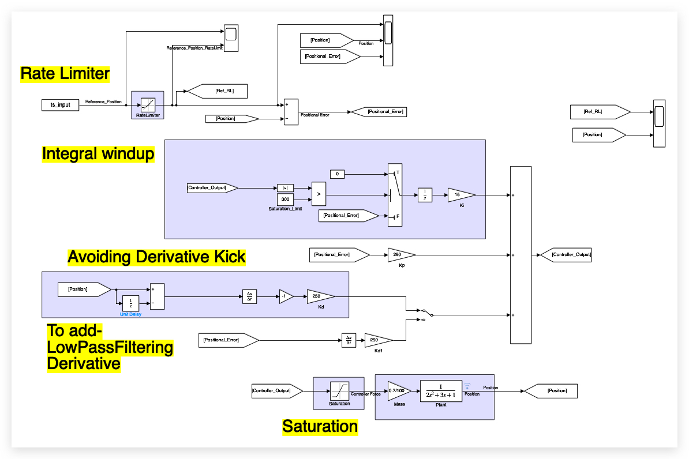
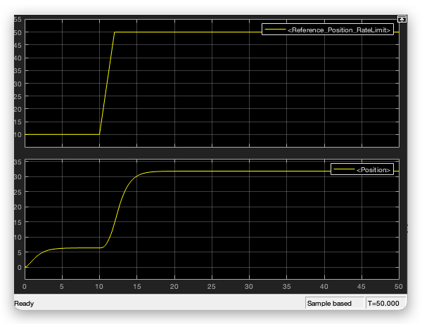

A Simulink model with PID control for a second order system (Train Model). Implementing production ready PID. 

## Process

Designing a PID that has
- Integral term to have zero steady state error
- Saturation block to avoid controller output becoming too high/low
- Low pass filter on the derivative term
- Fix for avoiding derivative kick
- Integral term saturation reset logic
- Rate limiter on input to avoid reference changing immediately

## Result

**Download the model:** [TrainModel.slx](./TrainModel.slx)

<!-- Matlab Code
% Define time vectors for 3 consecutive 10-second intervals
dt = 0.01;
t1 = (0:dt:10)';
t2 = (10+dt:dt:20)';
t3 = (20+dt:dt:30)';

% Concatenate time and signal data
t = [t1; t2; t3];
data = [10*ones(size(t1)); 50*ones(size(t2)); 50*ones(size(t3))];

% Create MATLAB timeseries object (ready for Simulink "From Workspace")
ts_input = timeseries(data, t); -->
